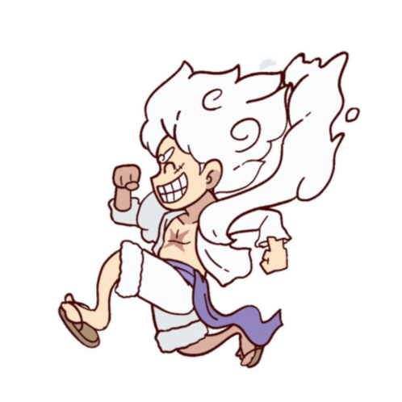

<!-- Wallpaper -->

  

<!-- Greeting -->
</h1>
<h1 align="center">👋 Hi I'm Mukhammad Emir, System Programmer</h1>

 

 

    
<!--👀VIEWS / 🌐WEBSITE: https://github.com/antonkomarev/github-profile-views-counter -->

<!-- about me -->
 <h3 align="left">☀️ About Me</h3>

<h4> 
I'm currently studying at University of Wollongong in Dubai. I am programming Python, C, Rust languages mostly. I have 5 years of amateur programming experience. I developed games on Unity, bots for Discord and Telegram, made a few websites and wrote artificial intelligence on Python</h4> 
 
  

   
  
    

  
  <!--
-->

</h4>

 

<!--Experence and experencing-->
<h3 align="center">🔆 Work'ed and Wor'king</h3>

    
    

<!-- git stat-->
<h3 align="center">⚡ Github Status</h3>
 

  

  

<!-- lang-->
<h3 align="center">📚 Languages & tools I Have placed My Hands On </h3>

 

   
     
     
     

 

<!-- top repo and teck stack-->

  <h3>⭐️ Top Repositories</h3>
  

    
    

  
  <h3>💻 Tech Stack:</h3>
      
  

    
  
  
  
  
  
  
  
  
  
  
  
  
  
  
  

  
 
  

<!--<h3>⭐ Top Contributed Repo!</h3>
        
      
       -->

<!-- support -->
<h3 align="center">Support Me 💰 </h3>

  
 <!-- -->

<!--<h1 align="center">
    
</h1>-->

<!-- ending-->

<h2 align="left">Hi 👋! I am Mukhammad  Emir, System Programmer</h2>

###

  
  

###

###

  
  
  
  
  
  
  
  
  
  
  
  
  

###

  
  
  
  
  
  

###
<picture>
  <source media="(prefers-color-scheme: dark)" srcset="https://raw.githubusercontent.com/crazyffester/crazyffester/output/github-snake-dark.svg" />
  <source media="(prefers-color-scheme: light)" srcset="https://raw.githubusercontent.com/crazyffester/crazyffester/output/github-snake.svg" />
  
</picture>
